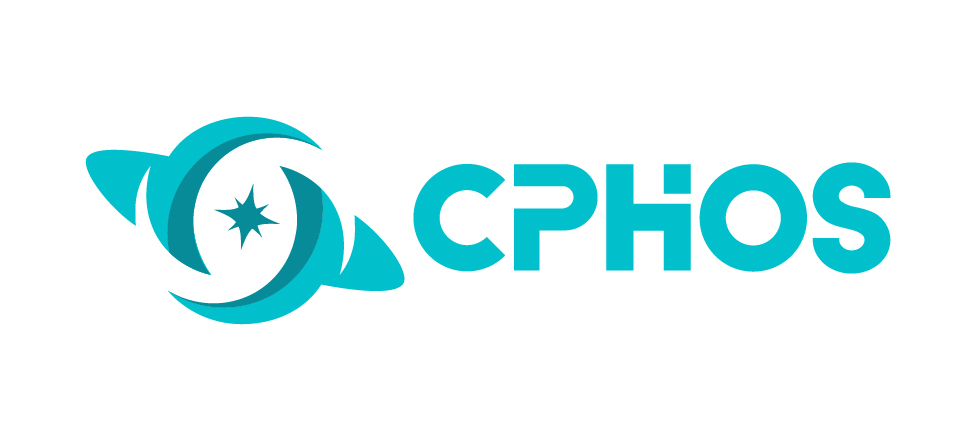

# CPHOS LaTeX 模板

<div align="center">
    
    <h2>CPHOS 物理竞赛联考 LaTeX 排版模板集合</h2>
</div>

## 模板类型

| 模板 | 目录 |
|------|------|------|
| 理论试题 | `theory/` |
| 实验试题 | `experiment/` |


## 快速开始

### 理论试题

```bash
cd theory/examples
xelatex example-problem.tex   # 命题模板
xelatex example-paper.tex     # 完整试卷
xelatex example-answersheet.tex  # 答题卡
```

详细使用说明请参阅 [theory/README.md](theory/README.md)。

## 项目结构

```
CPHOS-Latex/
├── theory/                # 理论试题模板
│   ├── cphos.cls          # 文档类
│   ├── cphos-scoring.sty  # 评分系统
│   ├── assets/            # 资源文件
│   ├── examples/          # 示例文件
│   └── README.md          # 使用说明
├── experiment/            # 实验试题模板
├── License                # 许可证
└── README.md              # 本文档
```

## 许可证

本项目采用 [MIT](License) 许可证

## 联系方式

- 官网：[www.cphos.cn](https://www.cphos.cn)
- 邮箱：service@cphos.cn
- 微信公众号：CPHOS
